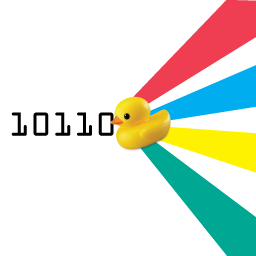

***
##Coding C# - Curriculum by Bit Shifting Duck initiative


Vidas Vasiliauskas
---
< wikipedia >
#### C# is an object oriented language (OOP)
</ wikipedia >
---
####List of Contents
* Intro
* Variables
* Domain events
* Loops
* Conditional Statements
* Simple data structures (Array, List)
---
``` cs
public class Human
{
}

var human = new Human();
```
---
* http://www.reactivemanifesto.org/
* http://reactivex.io/
* http://www.introtorx.com/
* https://github.com/Reactive-Extensions/
* https://github.com/Vasiliauskas
---
#Homework 1 - find integer in a list and return it's index (Console app)
#Homework 2 - sort an integer list (Console app)


